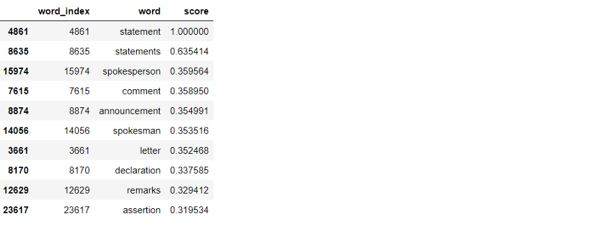
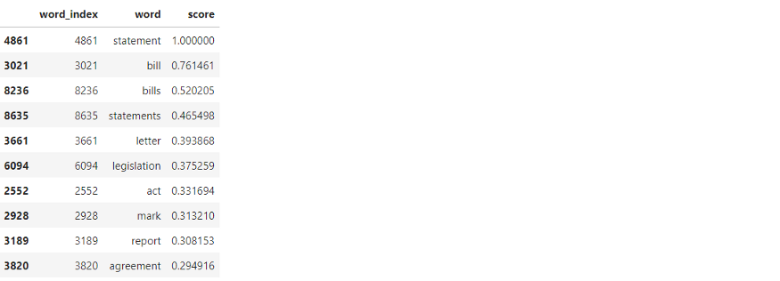
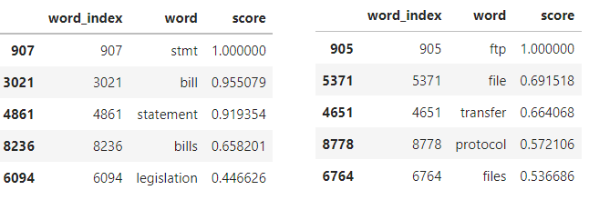

<!DOCTYPE html>
<html lang="en" data-rh="lang" style="">
<head><meta http-equiv="Content-Type" content="text/html; charset=UTF-8">

<button class="ay az ba bb bc bd be bf bg bh bi bj bk bl bm" aria-label="Share on twitter"><svg width="24" height="24" viewBox="0 0 24 24" fill="none"><path d="M20 5.34c-.67.41-1.4.7-2.18.87a3.45 3.45 0 0 0-5.02-.1 3.49 3.49 0 0 0-1.02 2.47c0 .28.03.54.07.8a9.91 9.91 0 0 1-7.17-3.66 3.9 3.9 0 0 0-.5 1.74 3.6 3.6 0 0 0 1.56 2.92 3.36 3.36 0 0 1-1.55-.44V10c0 1.67 1.2 3.08 2.8 3.42-.3.06-.6.1-.94.12l-.62-.06a3.5 3.5 0 0 0 3.24 2.43 7.34 7.34 0 0 1-4.36 1.49l-.81-.05a9.96 9.96 0 0 0 5.36 1.56c6.4 0 9.91-5.32 9.9-9.9v-.5c.69-.49 1.28-1.1 1.74-1.81-.63.3-1.3.48-2 .56A3.33 3.33 0 0 0 20 5.33" fill="#A8A8A8"></path></svg></button>

<button class="ay az ba bb bc bd be bf bg bh bi bj bk bl bm" aria-label="Share on facebook"><svg width="24" height="24" viewBox="0 0 24 24" fill="none"><path d="M19.75 12.04c0-4.3-3.47-7.79-7.75-7.79a7.77 7.77 0 0 0-5.9 12.84 7.77 7.77 0 0 0 4.69 2.63v-5.49h-1.9v-2.2h1.9v-1.62c0-1.88 1.14-2.9 2.8-2.9.8 0 1.49.06 1.69.08v1.97h-1.15c-.91 0-1.1.43-1.1 1.07v1.4h2.17l-.28 2.2h-1.88v5.52a7.77 7.77 0 0 0 6.7-7.71" fill="#A8A8A8"></path></svg></button>

<button class="ay az ba bb bc bd be bf bg bh bi bj bk bl bm" aria-label="Share on linkedin"><svg width="24" height="24" viewBox="0 0 24 24" fill="none"><path d="M19.75 5.39v13.22a1.14 1.14 0 0 1-1.14 1.14H5.39a1.14 1.14 0 0 1-1.14-1.14V5.39a1.14 1.14 0 0 1 1.14-1.14h13.22a1.14 1.14 0 0 1 1.14 1.14zM8.81 10.18H6.53v7.3H8.8v-7.3zM9 7.67a1.31 1.31 0 0 0-1.3-1.32h-.04a1.32 1.32 0 0 0 0 2.64A1.31 1.31 0 0 0 9 7.71v-.04zm8.46 5.37c0-2.2-1.4-3.05-2.78-3.05a2.6 2.6 0 0 0-2.3 1.18h-.07v-1h-2.14v7.3h2.28V13.6a1.51 1.51 0 0 1 1.36-1.63h.09c.72 0 1.26.45 1.26 1.6v3.91h2.28l.02-4.43z" fill="#A8A8A8"></path></svg></button>

<button class="ay az ba bb bc bd be bf bg bh bi bj bk bl bm"><svg width="24" height="24" viewBox="0 0 24 24" fill="none"><path fill-rule="evenodd" clip-rule="evenodd" d="M3.57 14.67c0-.57.13-1.11.38-1.6l.02-.02v-.02l.02-.02c0-.02 0-.02.02-.02.12-.26.3-.52.57-.8L7.78 9v-.02l.01-.02c.44-.41.91-.7 1.44-.85a4.87 4.87 0 0 0-1.19 2.36A5.04 5.04 0 0 0 8 11.6L6.04 13.6c-.19.19-.32.4-.38.65a2 2 0 0 0 0 .9c.08.2.2.4.38.57l1.29 1.31c.27.28.62.42 1.03.42.42 0 .78-.14 1.06-.42l1.23-1.25.79-.78 1.15-1.16c.08-.09.19-.22.28-.4.1-.2.15-.42.15-.67 0-.16-.02-.3-.06-.45l-.02-.02v-.02l-.07-.14s0-.03-.04-.06l-.06-.13-.02-.02c0-.02 0-.03-.02-.05a.6.6 0 0 0-.14-.16l-.48-.5c0-.04.02-.1.04-.15l.06-.12 1.17-1.14.09-.09.56.57c.02.04.08.1.16.18l.05.04.03.06.04.05.03.04.04.06.1.14.02.02c0 .02.01.03.03.04l.1.2v.02c.1.16.2.38.3.68a1 1 0 0 1 .04.25 3.2 3.2 0 0 1 .02 1.33 3.49 3.49 0 0 1-.95 1.87l-.66.67-.97.97-1.56 1.57a3.4 3.4 0 0 1-2.47 1.02c-.97 0-1.8-.34-2.49-1.03l-1.3-1.3a3.55 3.55 0 0 1-1-2.51v-.01h-.02v.02zm5.39-3.43c0-.19.02-.4.07-.63.13-.74.44-1.37.95-1.87l.66-.67.97-.98 1.56-1.56c.68-.69 1.5-1.03 2.47-1.03.97 0 1.8.34 2.48 1.02l1.3 1.32a3.48 3.48 0 0 1 1 2.48c0 .58-.11 1.11-.37 1.6l-.02.02v.02l-.02.04c-.14.27-.35.54-.6.8L16.23 15l-.01.02-.01.02c-.44.42-.92.7-1.43.83a4.55 4.55 0 0 0 1.23-3.52L18 10.38c.18-.21.3-.42.35-.65a2.03 2.03 0 0 0-.01-.9 1.96 1.96 0 0 0-.36-.58l-1.3-1.3a1.49 1.49 0 0 0-1.06-.42c-.42 0-.77.14-1.06.4l-1.2 1.27-.8.8-1.16 1.15c-.08.08-.18.21-.29.4a1.66 1.66 0 0 0-.08 1.12l.02.03v.02l.06.14s.01.03.05.06l.06.13.02.02.01.02.01.02c.05.08.1.13.14.16l.47.5c0 .04-.02.09-.04.15l-.06.12-1.15 1.15-.1.08-.56-.56a2.3 2.3 0 0 0-.18-.19c-.02-.01-.02-.03-.02-.04l-.02-.02a.37.37 0 0 1-.1-.12c-.03-.03-.05-.04-.05-.06l-.1-.15-.02-.02-.02-.04-.08-.17v-.02a5.1 5.1 0 0 1-.28-.69 1.03 1.03 0 0 1-.04-.26c-.06-.23-.1-.46-.1-.7v.01z" fill="#A8A8A8"></path></svg></button>

</header><section>

<h1 id="6be9" class="pw-post-title yq fk yr bv he ys yt yu yv yw yx yy yz za zb zc zd ze zf zg zh zi zj zk zl zm by" data-selectable-paragraph="">Fine Tuning Sentence Transformer Vectors without Model Training</h1>

<b>Read on Medium:</b> <a href=https://medium.com/@surajx42/fine-tuning-sentence-transformer-vectors-without-model-training-19fb7061134d>fine-tuning-sentence-transformer-vectors-without-model-training</a> 

In this tutorial , We will learn how we can fine tune Sentence Transformer without model training.

<strong class="ti he">What we are trying to achieve?:</strong>
<ol class=""><li id="1a48" class="abt abu yr ti b aba abb abd abe abg abv abk abw abo abx abs aby abz aca ea by" data-selectable-paragraph="">Modify Existing Embeddings to adapt it for our use case.</li><li id="b10a" class="abt abu yr ti b aba acb abd acc abg acd abk ace abo acf abs aby abz aca ea by" data-selectable-paragraph="">Add new words to the vocabulary</li></ol>
For this tutorial we are going to use “<a class="ay or" href="https://huggingface.co/sentence-transformers/paraphrase-MiniLM-L6-v2" rel="noopener ugc nofollow" target="_blank">sentence-transformers/paraphrase-MiniLM-L6-v2</a>” model

<strong class="ti he">What are sentence-Transformers?</strong>

Sentence Transformers is a Python framework for state-of-the-art sentence, text embeddings. It maps sentences &amp; paragraphs to a 384 dimensional dense vector space and can be used for tasks like semantic search , paraphrase mining.

<strong class="ti he">Paraphrase-MiniLM-L6-v2 : </strong>is based on BERT with 6 Transformer Encoder Layers ,  it can handle 512 tokens and return dense vector representation with 384 features.

Let’s Load the pretrained Sentence Transformer Model and the tokenizer
<pre class="acg ach aci acj xw oj jv ack">tokenizer <strong class="acn he">=</strong> AutoTokenizer<strong class="acn he">.</strong>from_pretrained('./sentence-transformer-paraphrase-MiniLM-L6-v2') model <strong class="acn he">=</strong> TFAutoModel<strong class="acn he">.</strong>from_pretrained('./sentence-transformer-paraphrase-MiniLM-L6-v2')</pre><h2 id="0e97" class="acl acm yr bv kx sj acr sk sn so acs sp ss abg act acu sx abk acv acw tc abo acx acy th acz by" data-selectable-paragraph="">Vocabulary Exploration</h2><pre class="acg ach aci acj xw oj jv ack">vocab_wrd2idx <strong class="acn he">=</strong> tokenizer<strong class="acn he">.</strong>vocab vocab_idx2wrd <strong class="acn he">=</strong> {v:k <strong class="acn he">for</strong> k,v <strong class="acn he">in</strong> vocab_wrd2idx<strong class="acn he">.</strong>items()}  print(len(vocab_wrd2idx))  sorted(vocab_wrd2idx<strong class="acn he">.</strong>items(),key<strong class="acn he">=lambda</strong> x:x[1])[0:10]#30522[('[PAD]', 0),  ('[unused0]', 1),  ('[unused1]', 2),  ('[unused2]', 3),  ('[unused3]', 4),  ('[unused4]', 5),  ('[unused5]', 6),  ('[unused6]', 7),  ('[unused7]', 8),  ('[unused8]', 9)]</pre>
We have 30,522 tokens in our vocab for paraphrase-MiniLM-l6-v2 model. It has 993 tokens which are not used, represented by [unusedXXX], These are the token which we can replace to add new tokens to our vocab.
<pre class="acg ach aci acj xw oj jv ack"><em class="aef">#extracting model weights</em> model_weights <strong class="acn he">=</strong> model<strong class="acn he">.</strong>get_weights()<em class="aef">#getting vocab weights</em> vocab_weights <strong class="acn he">=</strong> model_weights[0]</pre>
We are Extracting the model weight and selecting the first layer which contains the token embeddings.
<h1 id="84bf" class="aeg acm yr bv kx aeh aei aej sn aek ael aem ss st aen su sx sy aeo sz tc td aep te th aeq by" data-selectable-paragraph="">1. Modify Existing word embeddings to adapt it for our use case</h1>
Based on your use case same word can have different meaning in different context although transformers are capable of handling such scenarios but a lot of places:
<ul class=""><li id="86cb" class="abt abu yr ti b aba abb abd abe abg abv abk abw abo abx abs aew abz aca ea by" data-selectable-paragraph="">It wouldn’t have that much context to work with</li><li id="b97f" class="abt abu yr ti b aba acb abd acc abg acd abk ace abo acf abs aew abz aca ea by" data-selectable-paragraph="">The degree to which it’s considering the closeness is not satisfactory</li></ul>
That’s why fine-tuning is required on the data you are working with, but if you are not able to do it due to any reason , the following can help.

Eg: In Finance dataset, statements and bills are used synonymously, but since you are using a pretrained model there is high possibility that your model is not considering it to a degree which you would it to

Let’s understand the distribution of words close to statement
<pre class="acg ach aci acj xw oj jv ack"><em class="aef">#Function to find top_k similar words</em> <strong class="acn he">def</strong> most_similar(search_word,top_k<strong class="acn he">=</strong>5):     """This function takes a word and compute cosine similarity between the given word        and all other words and return top_k most similar words"""     search_idx <strong class="acn he">=</strong> vocab_wrd2idx[search_word]     similarity_ls<strong class="acn he">=</strong>[]     <strong class="acn he">for</strong> word_idx,word_embed <strong class="acn he">in</strong> enumerate(vocab_weights):         similarity_score <strong class="acn he">=</strong> cosine_similarity(vocab_weights[search_idx],word_embed)         similarity_ls<strong class="acn he">.</strong>append((word_idx,vocab_idx2wrd[word_idx],similarity_score))          <strong class="acn he">return</strong> pd<strong class="acn he">.</strong>DataFrame(similarity_ls,columns<strong class="acn he">=</strong>['word_index','word','score'])<strong class="acn he">.</strong>sort_values(by<strong class="acn he">=</strong>'score',ascending<strong class="acn he">=False</strong>)[0:top_k]most_similar('statement',top_k<strong class="acn he">=</strong>10)</pre><figure class="acg ach aci acj xw zr rn ro paragraph-image">

<picture><source data-testid="og" srcset="https://miro.medium.com/max/640/1*bmtEjOAJmrNH5WxFfQgkLA.png 640w, https://miro.medium.com/max/720/1*bmtEjOAJmrNH5WxFfQgkLA.png 720w, https://miro.medium.com/max/750/1*bmtEjOAJmrNH5WxFfQgkLA.png 750w, https://miro.medium.com/max/786/1*bmtEjOAJmrNH5WxFfQgkLA.png 786w, https://miro.medium.com/max/828/1*bmtEjOAJmrNH5WxFfQgkLA.png 828w, https://miro.medium.com/max/1100/1*bmtEjOAJmrNH5WxFfQgkLA.png 1100w, https://miro.medium.com/max/1400/1*bmtEjOAJmrNH5WxFfQgkLA.png 1400w" sizes="(min-resolution: 4dppx) and (max-width: 700px) 50vw, (-webkit-min-device-pixel-ratio: 4) and (max-width: 700px) 50vw, (min-resolution: 3dppx) and (max-width: 700px) 67vw, (-webkit-min-device-pixel-ratio: 3) and (max-width: 700px) 65vw, (min-resolution: 2.5dppx) and (max-width: 700px) 80vw, (-webkit-min-device-pixel-ratio: 2.5) and (max-width: 700px) 80vw, (min-resolution: 2dppx) and (max-width: 700px) 100vw, (-webkit-min-device-pixel-ratio: 2) and (max-width: 700px) 100vw, 700px"></picture>

</figure>
From the above output we see that the general context for the word “statement” is considered as the data distribution of the corpus used, is fairly broad in terms of domains/categories, so a general model of language is attained.

Let’s understand the vector closeness between statement and bill
<pre class="acg ach aci acj xw oj jv ack">cosine_similarity(vocab_weights[vocab_wrd2idx['statement']],vocab_weights[vocab_wrd2idx['bill']])#output 0.1263842135667801</pre>
From the above result, we can see that the similarity between the word “statement” and “bill” is substantially less than we would like it to be, now with transformer model this comparison technique is not completely accurate, as we are just taking the embeddings from the first layer where no context modelling is done.

Let’s look at the similarity between encoded sentences with the model
<pre class="acg ach aci acj xw oj jv ack">text1 = 'please send me the statement' text2 = 'please transfer the statement'vector1 = encode(tokenizer,text1) vector2 = encode(tokenizer,text2)cosine_similarity(vector1,vector2)#Output: 0.7034520506858826</pre>
Both sentences are similar, and we are getting a similarity score of 0.70 which is reasonable
<pre class="acg ach aci acj xw oj jv ack">text1 = 'please send me the bill' text2 = 'please transfer the statement'vector1 = encode(tokenizer,text1) vector2 = encode(tokenizer,text2)cosine_similarity(vector1,vector2)#Output: 0.3917175233364105</pre>
Now with statement replaced in one sentence the score is dropping by a lot, Ideally, we would like it to be greater than 50% at least.
<h1 id="a3f1" class="aeg acm yr bv kx aeh aei aej sn aek ael aem ss st aen su sx sy aeo sz tc td aep te th aeq by" data-selectable-paragraph="">Let’s understand the role of context here</h1>
<strong class="ti he">Example 1:</strong> Without proper context
<pre class="acg ach aci acj xw oj jv ack">text1 = 'i did not recieve any bill' #from the bank text2 = "i did'nt got any statement" #from the bankvector1 = encode(tokenizer,text1) vector2 = encode(tokenizer,text2)cosine_similarity(vector1,vector2)#Output: 0.3873918354511261</pre>
<strong class="ti he">Result: </strong>Similarity Score is very low as general meaning of bill is considered here.

<strong class="ti he">Example 2:</strong> With Added Context
<pre class="acg ach aci acj xw oj jv ack">text1 = 'i did not recieve any bill from the bank' text2 = "i did'nt got any statement from the bank"vector1 = encode(tokenizer,text1) vector2 = encode(tokenizer,text2)cosine_similarity(vector1,vector2)#Output: 0.6437106728553772</pre>
<strong class="ti he">Result:</strong> just by adding “from the bank”, we can observe a significant improvement from 0.38 to 0.64 in the similarity score.

But while working with the data it’s not necessary that a proper context will be always present.

Let’s go back to our previous example and try to modify the embeddings to get reasonable similarity score.
<pre class="acg ach aci acj xw oj jv ack"><strong class="acn he">def</strong> weighted_average_of_vectors(word_wghts):     """This Function takes words and thier weights and creates a new vector taking weighted avg of the vectors"""          vector <strong class="acn he">=</strong> np<strong class="acn he">.</strong>zeros(384, dtype<strong class="acn he">=</strong>np<strong class="acn he">.</strong>float64)          <strong class="acn he">for</strong> key,value <strong class="acn he">in</strong> word_wghts<strong class="acn he">.</strong>items():         vector <strong class="acn he">+=</strong> (1 <strong class="acn he">-</strong> value) <strong class="acn he">*</strong> vocab_weights[vocab_wrd2idx[key]]          vector <strong class="acn he">=</strong> normalize(vector<strong class="acn he">.</strong>reshape(1,<strong class="acn he">-</strong>1))[0]          <strong class="acn he">return</strong> vector<em class="aef">#modifying the embedding of statement to incorporate meaning of bill as well in the vector</em>  stmt_wghts <strong class="acn he">=</strong> {     'statement':0.5,     'bill':0.5 }  vocab_weights[vocab_wrd2idx['statement']] <strong class="acn he">=</strong> weighted_average_of_vectors(stmt_wghts)<em class="aef">#settings updated weights</em> model_weights[0] <strong class="acn he">=</strong> vocab_weights model<strong class="acn he">.</strong>set_weights(model_weights)most_similar('statement',top_k<strong class="acn he">=</strong>10)</pre><figure class="acg ach aci acj xw zr rn ro paragraph-image">

<picture><source data-testid="og" srcset="https://miro.medium.com/max/640/1*Vacu3UJ37QAK7kY_C5nsTA.png 640w, https://miro.medium.com/max/720/1*Vacu3UJ37QAK7kY_C5nsTA.png 720w, https://miro.medium.com/max/750/1*Vacu3UJ37QAK7kY_C5nsTA.png 750w, https://miro.medium.com/max/786/1*Vacu3UJ37QAK7kY_C5nsTA.png 786w, https://miro.medium.com/max/828/1*Vacu3UJ37QAK7kY_C5nsTA.png 828w, https://miro.medium.com/max/1100/1*Vacu3UJ37QAK7kY_C5nsTA.png 1100w, https://miro.medium.com/max/1400/1*Vacu3UJ37QAK7kY_C5nsTA.png 1400w" sizes="(min-resolution: 4dppx) and (max-width: 700px) 50vw, (-webkit-min-device-pixel-ratio: 4) and (max-width: 700px) 50vw, (min-resolution: 3dppx) and (max-width: 700px) 67vw, (-webkit-min-device-pixel-ratio: 3) and (max-width: 700px) 65vw, (min-resolution: 2.5dppx) and (max-width: 700px) 80vw, (-webkit-min-device-pixel-ratio: 2.5) and (max-width: 700px) 80vw, (min-resolution: 2dppx) and (max-width: 700px) 100vw, (-webkit-min-device-pixel-ratio: 2) and (max-width: 700px) 100vw, 700px"></picture>

</figure>
<strong class="ti he">Result</strong>: From the above result we can observe that now bill and statement vectors are nearby in the vector space.

<strong class="ti he">Example 3:</strong> After Updating the Embedding
<pre class="acg ach aci acj xw oj jv ack">text1 <strong class="acn he">=</strong> 'please send me the bill' text2 <strong class="acn he">=</strong> 'please transfer the statement'  vector1 <strong class="acn he">=</strong> encode(tokenizer,text1) vector2 <strong class="acn he">=</strong> encode(tokenizer,text2)  cosine_similarity(vector1,vector2)#Output: 0.5900149941444397</pre>
<strong class="ti he">Result:</strong> Now with the embeddings modified we see a significant jump in similarity score from 0.38 (Example 1) to 0.59.
<h1 id="faec" class="aeg acm yr bv kx aeh aei aej sn aek ael aem ss st aen su sx sy aeo sz tc td aep te th aeq by" data-selectable-paragraph="">2. Add New Words to Vocabulary</h1>
Suppose you have trained your model or you are using a pretrained model but you observe that some important words are missing from the vocabulary, and you don’t want to retrain the model with new data, you can follow the below method to add new word/tokens to your model.
<pre class="acg ach aci acj xw oj jv ack"><em class="aef">#checking if words are in vocab</em>  words_to_add <strong class="acn he">=</strong> ["stmt","ftp",'http']  [wrd <strong class="acn he">in</strong> tokenizer<strong class="acn he">.</strong>vocab <strong class="acn he">for</strong> wrd <strong class="acn he">in</strong> words_to_add]#Output: [False, False, True]</pre>
<strong class="ti he">Result:</strong> only http is present in the vocab. ftp and stmt (short for stament) is not present (you can always replace the word at preprocessing,this is just for demonstration)

Let’s try to add the words ‘ftp’ and ‘stmt’ to the vocabulary.
<pre class="acg ach aci acj xw oj jv ack"><strong class="acn he">def</strong> add_word(word_to_replace,word_to_add,word_wghts):     '''This Function takes the token to replace , word to add and word weights,        and replaces the word and it's embedding.     '''     <em class="aef">#editing the dictionary </em>     vocab_index <strong class="acn he">=</strong> vocab_wrd2idx[word_to_replace]     vocab_wrd2idx[word_to_add] <strong class="acn he">=</strong> vocab_index     <strong class="acn he">del</strong> vocab_wrd2idx[vocab_idx2wrd[vocab_index]]     vocab_idx2wrd[vocab_index] <strong class="acn he">=</strong> word_to_add          <em class="aef">#add the vector</em>     vocab_weights[vocab_index] <strong class="acn he">=</strong> weighted_average_of_vectors(word_wghts)          <em class="aef">#settings weights</em>     model_weights[0] <strong class="acn he">=</strong> vocab_weights     model<strong class="acn he">.</strong>set_weights(model_weights)<em class="aef">#defining weights for new words</em>  ftp_wghts <strong class="acn he">=</strong> {     'file':0.3,     'transfer':0.3,     'protocol':0.4, }  stmt_wghts <strong class="acn he">=</strong> {     'statement':0.5,     'bill':0.5 }  <em class="aef">#adding words</em> add_word('[unused900]','ftp',ftp_wghts) add_word('[unused902]','stmt',stmt_wghts)</pre>
Let’s check the most similar words to the newly added words
<pre class="acg ach aci acj xw oj jv ack">most_similar('stmt') most_similar('ftp')</pre><figure class="acg ach aci acj xw zr rn ro paragraph-image">
<picture><source data-testid="og" srcset="https://miro.medium.com/max/640/1*43K9A5v54tVUAC1-3qdjmw.png 640w, https://miro.medium.com/max/720/1*43K9A5v54tVUAC1-3qdjmw.png 720w, https://miro.medium.com/max/750/1*43K9A5v54tVUAC1-3qdjmw.png 750w, https://miro.medium.com/max/786/1*43K9A5v54tVUAC1-3qdjmw.png 786w, https://miro.medium.com/max/828/1*43K9A5v54tVUAC1-3qdjmw.png 828w, https://miro.medium.com/max/1100/1*43K9A5v54tVUAC1-3qdjmw.png 1100w, https://miro.medium.com/max/1292/1*43K9A5v54tVUAC1-3qdjmw.png 1292w" sizes="(min-resolution: 4dppx) and (max-width: 700px) 50vw, (-webkit-min-device-pixel-ratio: 4) and (max-width: 700px) 50vw, (min-resolution: 3dppx) and (max-width: 700px) 67vw, (-webkit-min-device-pixel-ratio: 3) and (max-width: 700px) 65vw, (min-resolution: 2.5dppx) and (max-width: 700px) 80vw, (-webkit-min-device-pixel-ratio: 2.5) and (max-width: 700px) 80vw, (min-resolution: 2dppx) and (max-width: 700px) 100vw, (-webkit-min-device-pixel-ratio: 2) and (max-width: 700px) 100vw, 646px"></picture>
</figure>
<strong class="ti he">Inference: </strong>From the above table we can infer that the new words added have a proper vector representation and are close to similar meaning words.

We have successfully added the new word and the embeddings, but the tokenizer vocab is not updated, it cannot be directly updated, so, we will be write our vocab dictionary to the tokenizer.json and then load the updated tokenizer.
<pre class="acg ach aci acj xw oj jv ack"><em class="aef">#Updating the tokenizer</em> <strong class="acn he">with</strong> open('./sentence-transformer-paraphrase-MiniLM-L6-v2/tokenizer.json','r',encoding<strong class="acn he">=</strong>'utf-8') <strong class="acn he">as</strong> f:     tokenizer_json <strong class="acn he">=</strong> json<strong class="acn he">.</strong>load(f)      tokenizer_json['model']['vocab']<strong class="acn he">=</strong>dict(sorted(vocab_wrd2idx<strong class="acn he">.</strong>items(),key<strong class="acn he">=lambda</strong> x:x[1]))  <em class="aef">#renaming vocab file </em>  os<strong class="acn he">.</strong>chdir('./sentence-transformer-paraphrase-MiniLM-L6-v2')  <em class="aef">#renaming old vocab file</em> <strong class="acn he">!</strong>ren tokenizer.json tokenizer_old.json  os<strong class="acn he">.</strong>chdir('../')  <strong class="acn he">with</strong> open('./sentence-transformer-paraphrase-MiniLM-L6-v2/tokenizer.json','w',encoding<strong class="acn he">=</strong>'utf-8') <strong class="acn he">as</strong> f:     json<strong class="acn he">.</strong>dump(tokenizer_json,f)</pre>
Loading the updated Tokenizer:
<pre class="acg ach aci acj xw oj jv ack">updated_tokenizer <strong class="acn he">=</strong> AutoTokenizer<strong class="acn he">.</strong>from_pretrained('./sentence-transformer-paraphrase-MiniLM-L6-v2')<em class="aef">#checking if words are in vocab</em>  words_to_add <strong class="acn he">=</strong> ["stmt","ftp",'http']  [wrd <strong class="acn he">in</strong> updated_tokenizer<strong class="acn he">.</strong>vocab <strong class="acn he">for</strong> wrd <strong class="acn he">in</strong> words_to_add]#Output:[True, True, True]</pre>
<strong class="ti he">Inference: </strong>The New Tokenizer has all the updated words

Now, Let’s compare the similarity between the sentences before and after adding the missing words.
<h1 id="5daa" class="aeg acm yr bv kx aeh aei aej sn aek ael aem ss st aen su sx sy aeo sz tc td aep te th aeq by" data-selectable-paragraph="">Sample 1:</h1>
With Old Tokenizer without the word stmt added
<pre class="acg ach aci acj xw oj jv ack">text1 <strong class="acn he">=</strong> 'the statement is incorrect' text2 <strong class="acn he">=</strong> 'the stmt is wrong'  vector1 <strong class="acn he">=</strong> encode(tokenizer,text1) vector2 <strong class="acn he">=</strong> encode(tokenizer,text2)  cosine_similarity(vector1,vector2)#Output 0.3759283423423767</pre>
With Updated Tokenizer containing the word stmt
<pre class="acg ach aci acj xw oj jv ack">text1 <strong class="acn he">=</strong> 'the statement is incorrect' text2 <strong class="acn he">=</strong> 'the stmt is wrong'  vector1 <strong class="acn he">=</strong> encode(updated_tokenizer,text1) vector2 <strong class="acn he">=</strong> encode(updated_tokenizer,text2)  cosine_similarity(vector1,vector2)#Output 0.8123685717582703</pre>
<strong class="ti he">Result:</strong> From the above Example we observe a significant improvement on Similarity Score, as the model now has an understanding of the word stmt, Earlier the old Tokenizer was breaking the word <em class="aef">“stmt”</em> into <em class="aef">‘st’</em> and <em class="aef">‘##mt’</em> as it couldn’t find stmt in the vocab.
<h1 id="616f" class="aeg acm yr bv kx aeh aei aej sn aek ael aem ss st aen su sx sy aeo sz tc td aep te th aeq by" data-selectable-paragraph="">Sample 2:</h1>
With Old Tokenizer without the word ftp added
<pre class="acg ach aci acj xw oj jv ack">text1 <strong class="acn he">=</strong> 'unable to upload the data through ftp' text2 <strong class="acn he">=</strong> 'file transfer protocol upload is not working'  vector1 <strong class="acn he">=</strong> encode(tokenizer,text1) vector2 <strong class="acn he">=</strong> encode(tokenizer,text2)  cosine_similarity(vector1,vector2)#Output: 0.6022258400917053</pre>
With Updated Tokenizer containing the word ftp
<pre class="acg ach aci acj xw oj jv ack">text1 <strong class="acn he">=</strong> 'unable to upload the data through ftp' text2 <strong class="acn he">=</strong> 'file transfer protocol upload is not working'  vector1 <strong class="acn he">=</strong> encode(updated_tokenizer,text1) vector2 <strong class="acn he">=</strong> encode(updated_tokenizer,text2)  cosine_similarity(vector1,vector2)#Output: 0.766219437122345</pre>
<strong class="ti he">Result:</strong> In this case as well, we can observe a good increase in Similarity Score

<strong class="ti he">Conclusion: From the above experiments</strong>
<ul class=""><li id="883e" class="abt abu yr ti b aba abb abd abe abg abv abk abw abo abx abs aew abz aca ea by" data-selectable-paragraph="">We learnt how we can add new tokens and modify the existing vectors manually to Increase the model Performance</li><li id="92bc" class="abt abu yr ti b aba acb abd acc abg acd abk ace abo acf abs aew abz aca ea by" data-selectable-paragraph="">We understood the model Architecture, and understood why there are so many [unused0] tokens available in the vocabulary</li><li id="a9ed" class="abt abu yr ti b aba acb abd acc abg acd abk ace abo acf abs aew abz aca ea by" data-selectable-paragraph="">Understood the importance of context for Embeddings</li><li id="f24f" class="abt abu yr ti b aba acb abd acc abg acd abk ace abo acf abs aew abz aca ea by" data-selectable-paragraph="">Built Functions like:</li></ul><blockquote class="afa afb afc">
most_similar to understand the words similarity in vector space,

add_words,weighted_average_of_vectors to add new words to our vocab
</blockquote>
— — — — — — — — — — — — — — — — — — — — — — — — — — — — — — —

<strong class="ti he">Connect On: </strong><a class="ay or" href="https://www.linkedin.com/in/suraj-kumar-710382a7/" rel="noopener ugc nofollow" target="_blank"><strong class="ti he">LinkedIn: Suraj Kumar</strong></a>

</section>

</article>

</body></html>
